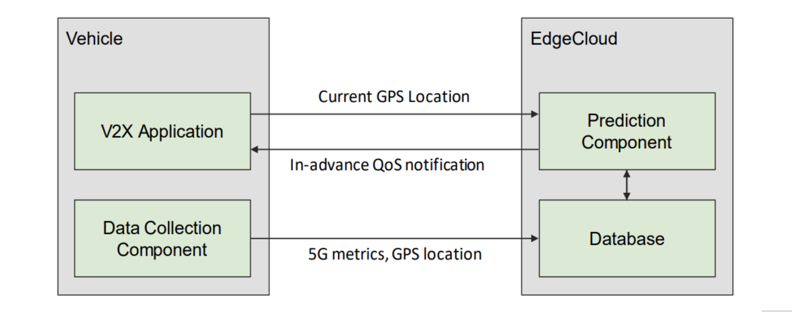
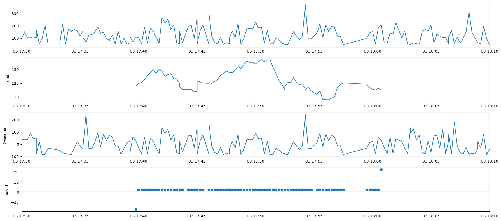
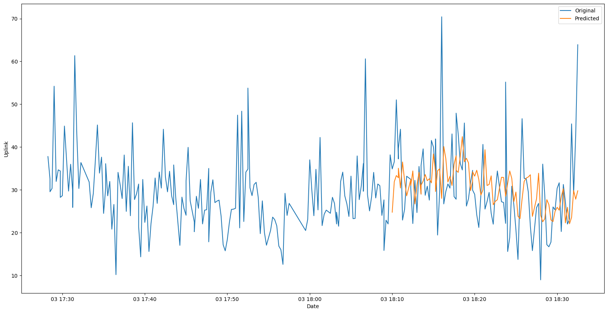
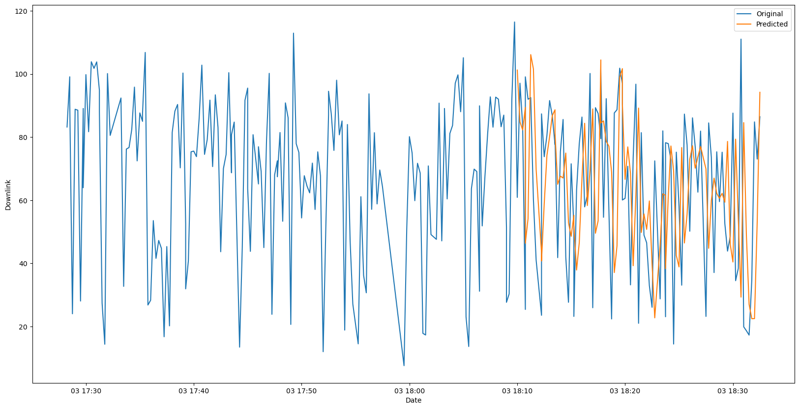
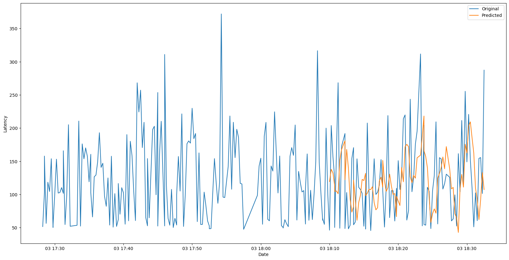

# Topic2 - QoS4CAM

## Project Objectives

**Predictive QoS** is a mechanism that enables the mobile network to provide in-advance
notifications about predicted QoS changes to interested consumers in order to take a proper
action _before_ the predicted QoS Changes actually effects.

Our objective is to write a program that is capable of making these **QoS predictions** with **in-advancaed-notifications**.

## Architecture

- **Vehicle**
  - V2X Application
  - Data Collection Component

- **Edge Cloud**
  - Database 
  - Prediction Function


- **How does it work?** ////////MORE DETAILED!
1. The _Data Collection Component_ sends data (including 5G Metrics, GPS Collection) and sends it to the _Database_.

2. The _Database_ sends the collected and aggregated Data to the _Prediction Function_.

3. The _Predicion Function_  then sends the in-advanced QoS notification back to the _Vehicle_.

## Data Collection Component
ADD!


## Database / InfluxDB
ADD!


## Models for Data Prediction Component

0.  We are going to focus on make a prediction about **_Uplink_**, **_Downlink_** and **_Latency_** of the dataset.

1. **SARIMA(Autoregressive Integrated Moving Average) Model** 
- _unsupervised_ machine learning
  - SARIMA models are a general class of models used for forecasting **time series data**. 
  - SARIMA models are generally denoted as **SARIMA (p,d,q)**  where p is the order of **autoregressive model**, d is the degree of **differencing**, and q is the order of **moving-average** model. 
  - SARIMA models use differencing to convert a non-stationary time series into a **stationary** one, and then predict future values from historical data. These models use “auto” correlations and moving averages over residual errors in the data to forecast future values.   

- Step by Step to the goal !
- [x] Import data
- [x] Arrange data : Create Dataframe & Normeralize & Clean Data & Check as a graph 
- [x] Split data for Train and Test
- [x] Check Stationarity : Decomposition                <details><summary>Click to see the result of Decomposition </summary>  </details>
- [x] Find p,q and d parameter for the best model
- [x] Train : Fit SARIMA Model with corresponding p,q and d parameter
- [x] Predict with train-data & Compare the predicted datas with the test-data (as a graph) to check how well it is trained.
- [x] Forecast the values in the future
- [x] Measure prediction performance of different algorithms (MAE, MSE, RMSE, R2, MAPE)
- [x] Check Residuals

- You can check codes for SARIMA model [here](https://gitlab-edu.aot.tu-berlin.de/ws22-scs/topic2-qos4cam/-/tree/main/Prediction%20Component%20-%20with%20SARIMA%20Model)
     - Uplink :
       - Sarima Training [Result](Prediction Component - with SARIMA Model/Latency/sarima_result.png)
       - Uplink Prediction graph
       - Performance of Uplink Prediction : 
        You can run the codes from [here](https://gitlab-edu.aot.tu-berlin.de/ws22-scs/topic2-qos4cam/-/tree/main/Prediction%20Component%20-%20with%20SARIMA%20Model/Uplink) and check the performance! 
           <details><summary>Click here to see the performance result</summary>{'mae': 8.015671591326093,'mse': 116.19679785795836,'rmse': 10.7794618538199,'r2': -0.17180019788430068,'mape': 30.06027411440433}</details>
            
     - Downlink : 
       - Sarima Training [Result](Prediction Component - with SARIMA Model/Downlink/sarima_result.png)
       - Downlink Prediction graph
       - Performance of Downlink Prediction : 
        You can run the codes from [here](https://gitlab-edu.aot.tu-berlin.de/ws22-scs/topic2-qos4cam/-/blob/main/Prediction%20Component%20-%20with%20SARIMA%20Model/Downlink/Downlink_SARIMA_Prediction-2.py) and check the performance! 
           <details><summary>Click here to see the performance result</summary> {'mae': 22.893528001099334, 'mse': 806.4521199026358, 'rmse': 28.398100638997597, 'r2': -0.25762112551201555, 'mape': 62.44744684427901} </details>
     - Latency :
       - Sarima Training [Result](Prediction Component - with SARIMA Model/Latency/sarima_result.png)     
       - Latency Prediction graph
       - Performance of Latency Prediction : 
        You can run the codes from [here](https://gitlab-edu.aot.tu-berlin.de/ws22-scs/topic2-qos4cam/-/blob/main/Prediction%20Component%20-%20with%20SARIMA%20Model/Latency/Latency_SARIMA_Prediction-3.py) and check the performance! 
           <details><summary>Click here to see the performance result</summary> {'mae': 96.28103674345437, 'mse': 11938.352583008926, 'rmse': 109.26276851246689, 'r2': -2.2075009243468875,'mape': 124.73697644690154} </details>


2. **DNN(Deep neural network) Model**
- With using **Tensorflow** and **Keras** 
- _supervised_ deap learning 
  - DNN allows a model’s performance to increase in accuracy.
  - DNN is an artificial neural network (ANN) with multiple **hidden layers** between the input and output layers.[Two or more hidden layers comprise a Deep Neural Network](https://s7280.pcdn.co/wp-content/uploads/2020/07/Two-or-more-hidden-layers-comprise-a-Deep-Neural-Network.png)
- Step by Step to the goal !
  - [ ] /////////ADD! 


## Team Members and Main Responsibilities (Tentative)

- Louis Andrée -> 
    Responsible for the V2X Application, the EVB Board data collection and the communication between Edge Cloude and the Vehicle
- Onur Sen -> 
    Responsible for the Database Setup, the aggrgration and filtering of the received data from the EVB Board, and the communication between Prediction Component and Database 
- Yeji Shim ->
    Responsible for the Setup of the Prediction Component and the (generated) Data push to the Vehicle 

## Meeting schedule

On Discord every Friday at 18:00 to discuss our current goals and progess

## Key References and Background
- **Topic 2: Predictive QoS for Connected Automated Mobility** : defined in [SCS_Project_Topics_WS22_23](References/SCS_Project_Topics_WS22_23.pdf) of this repository.
- **5GAA_A-200055_eNESQO_TR_final.pdf** : [5GAA_A-200055_eNESQO_TR_final.pdf](References/5GAA_A-200055_eNESQO_TR_final.pdf) of this repository.

- **5GAA_White-Paper_Proactive-and-Predictive_v04_8-Jan.-2020-003.pdf** :  [5GAA_White-Paper_Proactive-and-Predictive_v04_8-Jan.-2020-003.pdf](References/5GAA_White-Paper_Proactive-and-Predictive_v04_8-Jan.-2020-003.pdf) of this repository.


## TOOLS 

For our project, we decided that **geo time series** would be the most ideal for Data analysis. For that we decided to use.

- **InfluxDB** (Database)

   - _What is InfluxDB?_ 
     - InfluxDB is an open-source time series database (TSDB) developed by the company InfluxData. It is written in the Go programming language for storage and retrieval of time series data in fields such as operations monitoring, application metrics, Internet of Things sensor data, and real-time analytics. It also has support for processing data from Graphite.[1] 
    - _How to install?_
      - Download [InfluxDB](https://www.influxdata.com/get-influxdb/)
      - Use Homwbrew on macOS like this :
      ```
      brew update
      brew install influxdb@1
      ```
      - You can also use Influx Cloud without installing ! [Click here and try Influx Cloud](https://cloud2.influxdata.com/signup)

- **Anaconda / Jupyter-Notebook** (Prediction with SARIMA Model)
    - _What is Anaconda ?_
        - Anaconda is a distribution of the Python and R programming languages for scientific computing (data science, machine learning applications, large-scale data processing, predictive analytics, etc.), that aims to simplify package management and deployment.
        - We use Jupyter-Notebook through Anaconda to implement SARIMA Model and make a predictive datas.
    - _How to install?_
        - [Download Anaconda ](https://www.anaconda.com)
        - You can also control whether or not your shell has the base environment activated each time it opens.

````
#The base environment is activated by default
conda config --set auto_activate_base True

#The base environment is not activated by default
conda config --set auto_activate_base False

#The above commands only work if conda init has been run first
conda init is available in conda versions 4.6.12 and later
````
- **Visual Studio Code** (Prediction with DNN Model & Control of the gathered data in general)
  - _What is Visual Studio Code?_
     - Visual Studio Code is a code editor redefined and optimized for building and debugging modern web and cloud applications.
  - _How to install?_
     - [Download here](https://code.visualstudio.com/download)

 
## Libraries
- **Pandas**
  -  _What is Pandas?_
      - [Pandas](https://pandas.pydata.org/docs/user_guide/index.html#user-guide) is a fast, powerful, flexible and easy to use open source data analysis and manipulation tool, built on top of the Python programming language.
   - _How to implement?_
     - When working with Anaconda : 
     `conda install pandas` 
     - When working with pip : `pip install pandas`
     - for example, `import pandas as pd` 

- **NumPy**
  -  _What is NumPy?_
     - NumPy is a library for the Python programming language, adding support for large, multi-dimensional arrays and matrices, along with a large collection of high-level mathematical functions to operate on these arrays.
  - _How to implement?_
     - When working with Anaconda : 
     `conda install numpy ` 
     - When working with pip : `pip install numpy`
     - for example, `import numpy as np` 

- **Matplotlib.pyplot**
  -  _What is matplotlib?_
     - [matplotlib.pyplot](https://matplotlib.org/stable/tutorials/introductory/pyplot.html) is a collection of functions that make matplotlib work like MATLAB. Each pyplot function makes some change to a figure: e.g., creates a figure, creates a plotting area in a figure, plots some lines in a plotting area, decorates the plot with labels, etc.
   - _How to implement?_
     - When working with Anaconda : 
     `conda install matplotlib ` 
     - When working with pip : `pip install matplotlib`
     - for example, `import matplotlib.pyplot as plt`

- **Statsmodels.api**
  -  _What is statsmodels?_
     - [statsmodels](https://www.statsmodels.org/stable/api.html) is a Python module that provides classes and functions for the estimation of many different statistical models, as well as for conducting statistical tests, and statistical data exploration.
     - In our project, we use this library for "_Decomposition to check Stationarity_" and for "_Fitting SARIMA Model_".
  - _How to implement?_
     - When working with Anaconda : 
     `conda install statsmodels ` 
     - When working with pip : `pip install statsmodels`
     - for example, `import statsmodels.api as sm`
- **Pmdarima**
  -  _What is Pmdarima?_
     - [Pmdarima](https://pypi.org/project/pmdarima/) (originally pyramid-arima) is a statistical library designed to fill the void in Python's time series analysis capabilities. This includes the equivalent of R's auto.arima functionality.
     - In our project, we use this library to "_Find p,q,d parameter for the best SARIMA Model_".
  - _How to implement?_
     - When working with Anaconda : 
     `conda install pmdarima ` 
     - When working with pip : `pip install pmdarima`
     - for example, `from pmdarima import auto_arima`

- **Tensorflow** (Prediction with DNN Model)
  - _What is Tensorflow?_
    - TensorFlow is a Python-friendly open source library for numerical computation that makes machine learning and developing neural networks faster and easier. 
With this end-to-end machine learning platform, we are going to acquire data, train models, serve predictions, and refine future results.
  - _How to implement?_
    -  Install TensorFlow with Python's pip package manager :

    `
    pip install tensorflow
    `
    - Run a TensorFlow container
    ```
    # Download latest stable image
    docker pull tensorflow/tensorflow:latest 
    # Start Jupyter server 
    docker run -it -p 8888:8888 tensorflow/tensorflow:latest-jupyter 
    ```
    
- **Keras** (Prediction with DNN Model)
  -  _What is Keras?_
     - [Keras](https://keras.io/about/) is an open-source software library that provides a Python interface for artificial neural networks. Keras acts as an interface for the TensorFlow library.
  - How to implement?
     - First, install tensorflow. 
     - `
    pip install keras
    `


